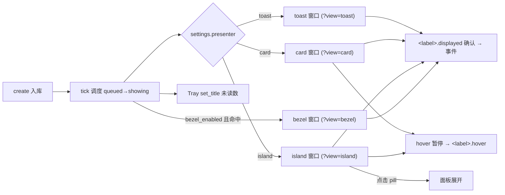

# 多呈现面 + JSON 样式 DSL 设计（multi-presenter-dsl）

日期：2026-10-07
状态：待评审
基线：a4e58e1 + 未提交的索引/格式化修复；16 Rust + 5 前端测试绿
范围：新增 Card / 灵动岛 / Bezel / Tray 徽章 / 面板 五个呈现面；JSON DSL 定义样式与布局；内置默认样式包。
前作：Swift 版 island-json-dsl 设计（git 1b134cf，513 行）已评审——其**边界哲学**全部继承，
渲染层（SwiftUI/kit）全部作废重写为 DOM。本文档不重述前作已裁决项，只记差异与新决策。

---

## 0. 背景与决策记录

需求：除 toast 外增加 Card、灵动岛、面板、Bezel、Tray 徽章；样式与布局用 JSON DSL 定义；默认带内置样式。

Linus 三问：

1. **真实问题？** 真实。单 presenter（toast 栈）对"一眼状态"（灵动岛 pill）、"重要单条"（Card）、
   "瞬时系统事件"（Bezel）三种节奏都是错的工具。前作双 presenter 已验证需求存在。
2. **更简单的做法？** 有：**presenter = 独立小入口（一个 HTML view + 一个窗口 + 一组 ack 命令）**，
   不做运行时注册表/热切换（Swift 版三道竞态 guard 的教训）。DSL 不发明 UI 框架——
   token → CSS 变量，节点 → DOM，渲染器是 200 行以内的纯函数。
3. **会被什么打破？** 现有 toast 行为零改动（无文件 = 今天的代码路径）；ack 协议向后兼容
   （`toast.displayed` 不改名）；SQLite schema 不加列。

逐项决策：

1. **主呈现面全局单选**：`settings.presenter ∈ {toast, card, island}`。Bezel 与 Tray 是**伴生面**
   （可叠加：`settings.bezel_enabled`、tray 徽章常开），不参与单选。面板不是推送面，是
   灵动岛/托盘的展开目标。不学 Swift 版做运行时切换——改设置 → 下一个 tick 生效，窗口
   按需 spawn/销毁。
2. **每个 presenter 一个 WebView 窗口，只 spawn 激活的**。窗口数 = 成本单位。全部复用
   `platform::ToastSurface` 材质遮罩机制（rects 数组本来就为任意轮廓设计）。
3. **ack 协议按窗口 label 泛化**：lib.rs 白名单从硬编码 toast 前缀改为
   `op 前缀 == window.label() 且后缀 ∈ {snapshot, displayed, interact, hover}`。
   仍显式拒绝未知 label。三行重复 → 一个模式匹配，这是消除重复不是抽象层。
4. **DSL 两层，主题先行**：主题 token（P7）零风险先落地；布局节点（P8）opt-in 后置。
   沿用前作裁决：**文件即开关、逐 surface 回退、默认渲染不走解释器**。
5. **web 技术把前作的三大难题变成非问题**：CSS 变量取代 ResolvedIslandTokens（主题解析
   = 一次性 `style.setProperty`，绘制路径零查找）；DOM 取代递归 SwiftUI（无 AnyView 问题、
   无类型嵌套问题）；重新渲染 = reconcile 已有 40 行实现。**不引入框架**（前一轮已裁决）。
6. **SF Symbols 不可用**（WebView 无桥）：图标闭集 = 内置 SVG 集合（复用现有 toast 的
   ✓ ! i 字形扩充为 SVG）+ `$icon` 绑定映射。不开放任意 URL 图标（SSRF/隐私面）。

---

## 1. 呈现面矩阵

| 面 | 窗口 | 生命周期 | 内容 | 主/伴 |
|---|---|---|---|---|
| toast 栈 | `toast`（现有） | 消息驱动 | 分组卡片 + 摘要卡 | 主（单选） |
| Card | `card`（新） | 消息驱动，单条大卡 | 最新一条，全文 + 动作 | 主（单选） |
| 灵动岛 pill | `island`（新） | 常驻（有未读/活动中） | 紧凑状态行 | 主（单选） |
| 面板 | `island` 窗口展开 或 `main` | 用户打开 | 当前消息 + 未读列表 | 展开目标 |
| Bezel | `bezel`（新） | 瞬时（1.5-2.5s） | 级别图标 + 一行文本 | 伴生 |
| Tray 徽章 | 无窗口 | 常驻 | 未读计数（tray title） | 伴生 |
| 历史中心 | `main`（现有） | 用户打开 | 全量历史 + 设置 | 已有 |

**呈现策略**：`notification.create` → store 判定 suppress/promote（不变）→ 激活的主呈现面
渲染；Bezel 在 `bezel_enabled` 且 level ∈ {success, error}（或 progress 事件）时**额外**闪现。
Tray 徽章随每次 `changed()` 更新未读数，读后清除。

---

## 2. 架构



### 2.1 Rust 侧（lib.rs / platform/）

- `WindowManager`（lib.rs 内 struct，~80 行）：`ensure(label)` / `destroy(label)`。
  `settings.presenter` 变更 → relay 线程比对当前 label，销毁旧、spawn 新。启动时按设置 spawn。
- 窗口定义表（label → builder 参数）：card 居中偏上 420×320 透明无装饰；island 刘海宽×32pt
  顶部居中（notch 检测：`NSScreen.safeAreaInsets.top > 0`，无刘海回退顶部居中悬浮 pill）；
  bezel 屏幕中心 280×140。
- ack 白名单泛化（§0.3）；`main`/toast 既有语义不变。
- Tray：`changed()` 后 `tray.set_title(unread>0 ? Some(count) : None)`，在现有 relay 任务里加两行。

### 2.2 Store 侧（store.rs，最小改动）

- `Settings` 增 `presenter`、`bezel_enabled`、`theme_id`、`layout_id`（4 个字段，serde default
  向后兼容，旧库零迁移）。
- snapshot 命令按窗口 label 分发：`card.snapshot` = 最新一条 showing + settings；`island.snapshot`
  = 最新一条 + 未读数 + 摘要；`bezel.snapshot` 同 card。**实现为一个 `snapshot()` 加 label 参数**，
  共用查询。
- promote/suppress/tick/恢复逻辑零改动——"showing" 语义不区分在哪儿显示（单选保证唯一消费者）。

### 2.3 前端侧（src/presenters/）

```
src/presenters/
  shared.ts        // snapshot 拉取、reconcile、displayed 确认、rAF 时序（从 toast/index.ts 提炼）
  toast.ts         // 现 toast/index.ts 平移
  card.ts          // 大卡：renderToastCard 复用 + 全文展开布局
  island.ts        // pill + hover 展开面板 + 命中区
  bezel.ts         // 图标 + 单行文本 + 自动消退
```

组件纪律（已裁决）：组件 = 纯函数 (props) → HTMLElement；样式 = applier；状态单一真相源
（snapshot）；不建 presenter 注册表——main.ts 的 `?view=` 路由就是注册表。

---

## 3. 各呈现面规格

### Card
- 最新一条 showing 通知，420×320（正文可滚动），级别色边、全文、进度、动作按钮。
- 消失：`display_duration_ms` 到时（hover 暂停同 toast）。新消息到达 → 替换内容（revision 对比，复用卡片节点保焦点）。
- 复用 `renderToastCard` + `applyToastStyle`；新增 `body_lines: 0 = 全文` 语义。

### 灵动岛（island）
- **pill（收起）**：刘海宽度窗口，高 32pt，紧凑状态行（图标 + 标题走马灯 + 未读徽章）。
  无刘海屏：顶部居中悬浮胶囊 pill。
- **展开（面板）**：hover/点击 pill → 窗口向下动画扩展至 ≤ 720×420：当前消息卡 + 未读列表
  （前 5）+ "查看全部"。再 hover 出或点击外部收起。
- **命中区**：pill 窗口尺寸 = pill 实际尺寸（不整屏），点击天然穿透；展开后窗口即面板大小。
  位置上报走现有 `resize_toast` 几何通道（改名 `resize_surface`，参数加 label）。
- **材质**：pill/面板各自一个 NSVisualEffectView 遮罩 rect（现有机制）。

### 面板（island 展开，非独立 presenter）
- 内容三槽：`headerActions` / `messageBody` / `list`（未读前 5）+ `footerActions`。
- 托盘点击 / `open_history` 菜单仍开 `main`（全量历史），面板是轻量版。

### Bezel
- 屏幕中心深色圆角块（macOS 音量指示器范式）：大图标（48pt）+ 单行标题，1.8s 自动消退，
  不响应 hover（瞬时面无暂停语义）。
- 触发：`bezel_enabled && (level ∈ {success,error} || progress 更新)`，与主呈现面并行。
- 生命周期简化：bezel 不发 displayed 确认（瞬时不占 showing 槽），只发 `bezel.shown` 事件供历史。

### Tray 徽章
- `set_title`：未读 > 0 显示数字，= 0 清空。读/归档 → changed() → 自动刷新。
- 不做图标叠加（Tauri 2 tray 无 overlay API，title 够用且零成本）。

---

## 4. JSON DSL 规范

### 4.1 两层文件

```
~/Library/Application Support/com.mac-desktop-notify/   (app_data_dir)
  styles/
    themes/  default.json  midnight.json  minimal.json  glass.json   # 内置包随 app 发布，同名用户文件覆盖
    layouts/ <id>.json                                                # opt-in，缺省 = 内置 TS 布局
```

- **主题 = token 平表 → CSS 变量**（`--mdn-accent` 等），一次 `setProperty` 全局生效。
- **布局 = 节点树 → DOM**（P8，opt-in；无文件 = 各 presenter 的内置 TS 渲染，即今天的代码路径）。

### 4.2 主题 token 闭集（P7 交付）

现有 `Settings.toast` 全字段平化为 token + 新面字段，默认值 = 今天字面量（验收：默认主题像素对拍零差异）：

```jsonc
{
  "name": "midnight",
  "tokens": {
    "accent": "#7c6cf0",  "cardFill": {"light":"#ffffff","dark":"#25252e"},
    "cardRadius": 16,     "titleSize": 15, "titleWeight": 600,
    "bodySize": 14,       "lineHeight": 1.6, "bodyLines": 5,
    "padding": 16, "gap": 8, "borderWidth": 1, "borderColor": "auto",
    "material": "none",   "tintOpacity": 35, "shadow": false,
    "levelSuccess": "#49a88b", "levelWarning": "#c89743", "levelError": "#df6e7b",
    "bezelFill": "#000000c4", "bezelIconSize": 48,
    "pillFill": "#000000d9", "pillHeight": 32, "panelMaxHeight": 420
  }
}
```

规则（继承前作）：未知 token 忽略；缺失取内置默认；颜色 `#hex` 或 `{light,dark}`；数值 clamp；
名走闭集。**settings.toast 字段保留为"简单设置"**——UI 编辑 = 写当前主题的 token（写穿），
theme_id = "default" 时写入 settings（兼容现状）。两套并存会漂移，故**主题文件是唯一真源，
settings.toast 序列化时由主题派生**（迁移：首次启动把旧 settings.toast 导出为 default.json）。

### 4.3 布局节点闭集（P8 交付，11 种照搬前作）

`vstack/hstack/zstack, text, icon, dot, badge, progress, divider, spacer, slot`；
修饰键 `if, frame, padding, background, clip, opacity`（顺序固定）。

- 取值：`$binding` / `@token` / `#hex` / 字面串。无表达式、无插值、无组合谓词（继承）。
- 绑定闭集（预格式化，格式化永远在 TS）：`$title $body $source $level $time $unread $progress
  $mergeCount $icon $status`；谓词闭集：`hasBody hasProgress hasTags manyUnread isCritical
  isWarning showTime manyMerged`（未知谓词 → true + 诊断，继承）。
- **slot 闭集**：`messageBody`（正文+滚动）、`actions`（动作按钮）、`list`（未读列表）、
  `summary`。行为/正文永远在 TS——DSL 摆位置（继承 §1 边界）。
- 渲染器：`renderNode(node, bindings, tokens) → HTMLElement`，纯函数递归，深度 ≤ 12、
  节点 ≤ 256、文件 ≤ 64KB、单串 ≤ 256（上限照搬）。
- 上限/宽容解码/节点路径诊断/fail-closed 逐面回退：全部照搬前作 §5。
- **差异**：前作 compactLeading/Trailing 两面 → 本作 pill 单面（DOM 无需拆 side）；
  marquee 用 CSS animation 实现（`text.marquee: true`）。

### 4.4 内置默认样式包（"默认添加样式"）

| ID | 风格 | 差异点 |
|---|---|---|
| `default` | 今天的外观 | token = 现值（迁移基准） |
| `midnight` | 纯黑毛玻璃 | material: popover, tint 20, 深色强制 |
| `minimal` | 极简浅色 | header hidden, 无边框, padding 12 |
| `glass` | 高透明 | material: hud, tint 12, shadow true |

每主题一份 layouts 示例仅 `midnight` 带（pill/面板两面），证明 DSL 可用即可。

---

## 5. 零破坏性论证

| 面 | 结论 |
|---|---|
| 无 styles/ 目录、settings 未动 | 所有 presenter 走内置 TS 路径 = 新写代码的默认分支；toast 行为 = 今天 |
| 旧 settings.toast | 首启导出 default.json，settings.toast 由主题派生，UI 字段与验证不变 |
| ack 协议 | `toast.*` 命令名不变；白名单泛化是放宽接收方不是改名 |
| SQLite | 仅 settings payload 加 4 字段（serde default），schema 零迁移 |
| push 协议 / 三 transport | 不碰 |
| 回滚 | theme_id/layout_id 删设置即回 default；删 styles/ 目录 = 内置路径 |

---

## 6. 分阶段实施

```
P1 基础设施：settings 4 字段 + WindowManager + ack 白名单泛化 + resize_surface(label)
   → 验证：改 presenter 设置，窗口按需 spawn/销毁；toast 回归零差异；全测试绿
P2 Card：card.ts + 卡片复用 + card.snapshot/displayed/interact
   → 验证：单条大卡全生命周期（含 hover 暂停、替换保焦点）
P3 Bezel：bezel.ts + 触发规则 + bezel.shown 事件
   → 验证：success/error 闪现、不占 showing 槽、与主面并行
P4 Tray 徽章：changed() → set_title
   → 验证：未读增减实时、读后清零
P5 灵动岛：notch 检测 + pill + 展开面板 + 命中区 + 走马灯
   → 验证：有/无刘海屏、hover 展开/收起、点击穿透、Esc 收起
P6 面板内容：三槽 + 未读列表 + footer
   → 验证：列表与历史一致、查看全部跳 main
P7 主题 token：themes/*.json + CSS 变量 + settings 派生 + 迁移导出 + 内置 4 主题
   → 验证：default 像素对拍零差异；切换即时生效；坏文件保留旧值
P8 布局 DSL：节点渲染器 + 绑定/谓词 + 逐面回退 + 诊断 + midnight 示例布局
   → 验证：恶意文件不崩、逐面回退、示例零诊断
P9 设置 UI：presenter 下拉 + 主题/布局选择 + 诊断展示
   → 验证：全部切换路径 + README
```

每阶段独立可发布；P1-P6 不依赖 DSL（用内置样式先跑通全部呈现面），P7/P8 是样式能力层。

## 7. 不做清单（YAGNI）

- presenter 运行时热切换注册表 / per-source 呈现路由 / 风格 profile 对象（Swift 版教训）
- push 侧 style/presenter 字段（等具名组合跑通后重估）
- DSL 里的表达式/循环/事件/动画曲线/窗口几何（继承前作 §8 全部）
- 任意图标 URL、自定义字体文件上传（字体走系统已装族，`fontFamily` token）
- 虚拟列表、拖拽（历史中心已有 main 窗口承担）

## 8. 风险

| 风险 | 缓解 |
|---|---|
| island 命中区挡菜单栏 | 窗口尺寸 = pill 实际尺寸，不整屏；无刘海回退路径单独验收 |
| settings.toast → 主题派生的迁移丢用户设置 | 首启导出前读旧值写 default.json；导出失败 = 内置默认（不阻塞启动） |
| 双真相源（settings UI 写 vs 手改文件） | 文件是唯一真源 + 目录 watch（200ms debounce）回读；UI 保存后 reload |
| Card 与 toast 的 displayed 竞争（切换 presenter 瞬间） | WindowManager 切换 = 销毁旧窗口 → 旧 ack 无人接收；tick 的 renderer_unavailable 10s 兜底收回 |
| Bezel 与主面同屏信息重复 | bezel 仅 success/error/progress，静音/勿扰规则同样生效（store 侧判定） |
