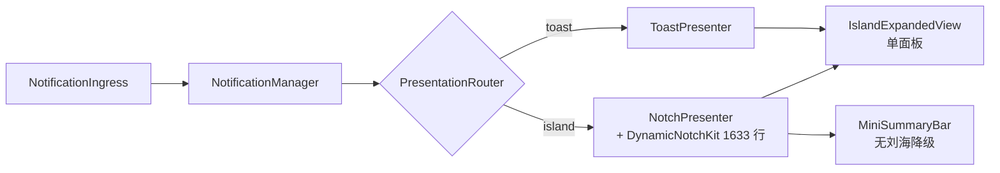
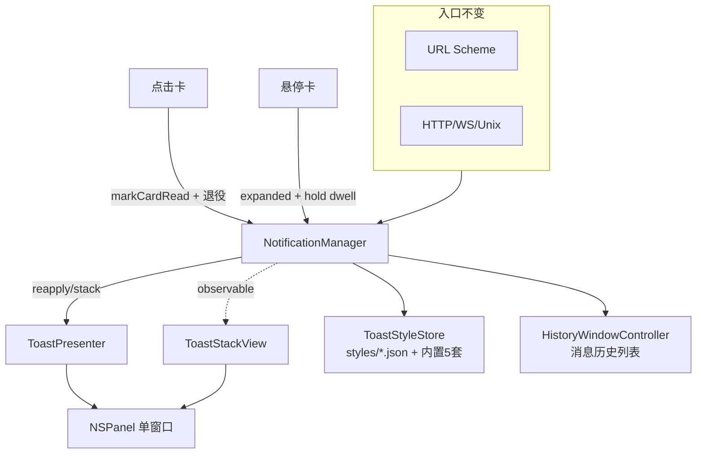

# 灵动岛 → 浮动 Toast 改造设计（toast-redesign）

日期：2026-10-08
状态：待评审
基线：main `f963a27`（Swift 6.4 / macOS 14 / 46 测试文件 520 用例）
**门禁实测（2026-10-08）**：`swift build` 12.4s；`swift test` 520 tests / 0 failures / 25.3s。
输入：用户 2026-10-08 需求 + 三项裁决（删灵动岛 / 样式走 JSON DSL / 悬停卡内就地展开）

---

## 0. 需求与裁决

### 0.1 需求

1. 不再使用灵动岛，toast 成为唯一通知面。
2. 定位支持右上、右下、屏幕顶部居中（菜单条下）。
3. 样式支持卡片、胶囊等，JSON 自定义 + 内置若干套。
4. 动画支持淡入淡出、滑入等多种。
5. 收起态是信息摘要；鼠标移入显示完整信息与操作按钮。
6. 多条消息层叠，观感与 macOS 通知中心一致。
7. 支持分组（grouping）、标签（tagging）、消息历史列表。
8. 点击消息默认动作 = 标记已读。
9. 展开体支持 Markdown；摘要只是纯文本，过长跑马灯。

### 0.2 三项裁决（用户已确认）

| 问题 | 裁决 | 后果 |
|---|---|---|
| 灵动岛去留 | **整套删除，toast 唯一** | 删 `Sources/DynamicNotchKit`、`Island/`、六个 presenter/view 文件、灵动岛设置与全部灵动岛测试 |
| 样式文件格式 | **JSON DSL** | 新建 toast 样式 DSL（token 表 + 宽容解析 + 内置预设 + 单选 picker），不沿用 island 的 11 节点布局树 |
| 悬停展开形态 | **卡内就地展开** | 单窗口内卡片变高，无第二个详情窗口 |

### 0.3 Linus 三问

1. **真实问题？** 真实。灵动岛依赖物理刘海（无刘海屏走迷你条降级，是两套渲染路径），
   且 toast 现在是单卡 + 无悬停 + 无样式 + 无动画的裸实现——四个明确缺口。
2. **更简单做法？** 有，且本文采用：**删除 presenter 双轨**（router + PresentationStyle +
   `displayState` 状态机全部蒸发），把 manager 的 `presentation: Presentation?`
   泛化成 `presentations: [Presentation]`，一个 NSPanel 装整栈卡片。不新增第二个窗口、
   不做 per-message 样式路由（`docs` 旧评审已否）。
3. **会被什么打破？** 推送协议只增 `tags` 一个字段；history.json 宽容解码零迁移；
   URL scheme `notch-notify://` 不改名（改名会打断所有现有脚本，超出范围）。

---

## 1. 现状（走读结论，均已在文件中核实）

### 1.1 呈现层双轨



`PresentationRouter`（`PresentationRouter.swift:14`）持 `[PresentationStyle: NotchPresenting]`，
`AppSettings.presentationStyle`（`AppSettings.swift:96`）运行时切换。
`NotchPresenting`（`NotificationManager.swift:21`）+ `reapply(on:)` 扩展（:69）是唯一共用地基。

### 1.2 状态机是单卡模型

- `presentation: Presentation?`（`NotificationManager.swift:163`）：**一条 live 消息 + 预算**。
- `displayState: NotchDisplayState`（`IslandDisplayState.swift:5`）= `closed | opened(reason:)`。
- `push` → `present(item)`（`+Presentation.swift:188`）**顶替**当前卡，旧卡落历史仍未读。
- dwell：`DelayedEvents.Key.dwell` 单键（`DelayedEvents.swift:17`），`startDwell`/`pauseDwell`（`+Dwell.swift:158-177`）。
- 已读显式规则（v4 §4，`+History.swift:104-110`）：hover/自动/超时/dismiss 都不标已读，
  只有 `markCurrentRead`（:114，来自 `summaryClicked` / `openMessageCenter`）、
  `setRead(id:)`（:143，行展开）、`performAction`→`markRead`（`NotificationManager.swift:514`）三条路径标。

### 1.3 toast 现状 = 四个缺口

| 缺口 | 证据 |
|---|---|
| 只有一个锚点 | `ToastLayout.anchoredFrame`（`ToastPresenter.swift:14-28`）硬编码右上 + margin 12 |
| 无悬停展开 | `ToastPresenter.swift:92-94`、`:122-126` 注释明说无激活区，只点击；无鼠标移动监视（只有点击监视 :302） |
| 无样式可配 | `ToastSummaryView`（:45-110）硬编码 `RoundedRectangle(panelRadius)` + `MarqueeText(maxWidth:220)` |
| 无动画 | 全文只有 `orderFrontRegardless`（:233）/ `orderOut`（:162）；动画词汇在面板侧（`IslandExpandedView.swift:214` transition） |

### 1.4 已有可复用资产（勿重造）

| 资产 | 位置 | 用途 |
|---|---|---|
| `MarqueeText` | `MarqueeText.swift:11-107` | 摘要跑马灯（TimelineView + 双副本 + 渐隐 mask + pause 时间 bank） |
| `MarkdownRenderer` + `MarkdownBlocksView` + `MarkdownCache` | 三文件 | 展开体 Markdown；`HistoryRow.previewText`（`MessageCards.swift:253-271`）已是「Markdown→纯文本摘要」实现 |
| `MessageCards` 的 `CurrentCard`/`ActionRow`/`InlineActionCapsules`/`OccurrenceTag` | `MessageCards.swift` | 卡片正文、按钮、×N 合并计数 |
| `PanelScrollView` | `PanelScrollView.swift` | nonactivating panel 自绘滚动条（系统 overlay 画不出来） |
| `PointerState` + `reduce(_:)` | `PointerState.swift`、`+Pointer.swift:11` | 指针状态机单一切换点；hover 链路全部与 presenter 无关，可直接复用 |
| `DelayedEvents` | `DelayedEvents.swift` | 键控延迟事件；dwell 改成 `dwell(UUID)` 即支持每卡一条 |
| `collapseGroup` + `occurrences` | `NotificationManager.swift:446-470` | push 时同组顶替、×N 计数；**分组机制已存在** |
| `HistoryWindowController` | `HistoryWindowController.swift` | 独立历史窗口（搜索/筛选/已读/删除）——「消息列表历史记录」已存在 |
| `IslandLayoutParser` 的宽容解析范式 | `Island/IslandLayoutParser.swift:29-97` | 新样式解析器的写法模板（上限常量 / 路径诊断 / version 整体回退 / 逐键宽容） |

### 1.5 不存在的东西

- **`tags` 全仓零命中**（scout 已核）：`NotchNotification` 无该字段，`PushValidator.Fields`、
  `APIRouter.PushDTO`/`WSCommandDTO`/`HistoryItemDTO`、`URLNotificationParser` 均无。
  tagging 是从零加字段。
- `markAsRead` 符号不存在；已读入口是 `markCurrentRead` / `markRead` / `setRead`。

---

## 2. 决策记录

### D1 删除 presenter 双轨与路由

`PresentationRouter`、`PresentationStyle`、`AppSettings.presentationStyle`、
`displayState`/`OpenReason` 全部删除。`AppDelegate` 直接 `attach(ToastPresenter())`。
`NotchPresenting` 保留（测试 spy 的地基 + `probeDisplaySuppressed` 真需求），
**改名 `SurfacePresenting`**—— notch 已删，名字留着就是腐烂源。

`reapply(on:)` 重写为：`!presentations.isEmpty && !displaySuppressed` → 显示栈窗口，否则隐藏。
原来四条 settle 分支（suppressed / opened / idle / compact）随 island 一起蒸发。

### D2 manager 泛化成多卡栈

```
presentations: [Presentation]      // 可见卡，oldest → newest
current: NotchNotification?        // presentations.last?.item（派生，API 名不变）
```

- push → `appendPresenting(item)`，**不再顶替**。
- 卡数上限 `visibleCardLimit`（默认 4，范围 1...6）；超限的推送直接落历史未读，
  由未读徽章与历史窗口承载。**不做栈滚动**：滚动的栈会把消息推出可见区，比不显示更糟。
- dwell 键改 `DelayedEvents.Key.dwell(UUID)`：每卡一条计时器，
  `startDwell`/`pauseDwell` 逻辑不变（`+Dwell.swift:158-177` 逐字保留）。
- 展开态是**每卡 UI 状态**：`Presentation.expanded: Bool` + `expandedByHover: Bool`，
  取代 `displayState`/`OpenReason`。critical 卡默认 `expanded = true`（延续「critical 占屏」语义）。
- 指针：`PointerIntent.hoverBegan(id: UUID)` / `hoverEnded(id:)`；`pointer.onCardID: UUID?`。
  悬停只 hold **该卡** dwell，其余继续倒计时（对齐 macOS）。
- §3 dismiss 规则（信息卡 10s auto-close、actions hold、critical aging）逐条保留，
  作用对象从「the live card」变成「the card」——`applyDismissRules()` 改成 per-card 循环。

**为什么不把栈放在 presenter 里？** dwell 预算、actions hold、critical aging、静默规则全在
manager；presenter 只该决定像素落点。把栈下沉到 presenter 等于让视图重算生命周期。

### D3 单窗口装整栈

一个 `NSPanel` + 一个 `NSHostingView(rootView: ToastStackView)`。
卡片进出/展开用手 SwiftUI `transition` + `animation`，**不碰 NSPanel 动画**
（panel 动画要 `NSAnimator` proxy，且窗口尺寸逐帧重算会抖）。

- 高度 = Σ卡片 + gaps，夹到 `visibleFrame.height * 0.6`。
- 定位参数化：`ToastLayout.frame(contentSize:in:position:)`，纯函数、可测。
- `topCenter` 落在 `visibleFrame.maxY - margin - height`——`visibleFrame` 已排除菜单条，无需特判。

栈序（远离锚点边生长）：

| position | 最新卡落在 |
|---|---|
| topRight / topCenter | 栈底（最下） |
| bottomRight | 栈顶（最上） |

### D4 样式 JSON DSL（新建，不沿用 island 布局树）

用户要的是「样式卡 + 内置几套」，不是 11 节点布局树。island DSL 的
`IslandNode`/`IslandSlot`/9 绑定/13 谓词（~1800 行）是为刘海壳体的盒子摆位设计的，
删了 notch 之后这套机器没有服务对象。**新建 ~300 行的 token 表 DSL**，
宽容解析 / 热重载 / 随包 / 单选 picker 四件机制照抄 island 的成熟实现。

```
~/Library/Application Support/MacDesktopNotify/
  styles/<id>.json     # 用户同名覆盖内置
```

内置 5 套（`Sources/MacDesktopNotify/Builtin/styles/`，随包发布）：

| id | 形态 | 差异点 |
|---|---|---|
| `default` | card | 迁移基准：token = 今天 ToastSummaryView 的字面量 |
| `pill` | collapsed=pill, expanded=card | 收起态胶囊（`pillHeight` 28 / `clip=capsule`） |
| `midnight` | card | 深色玻璃底 + 发光描边 + shadow |
| `minimal` | card | 无边框、`header=hidden`、padding 12 |
| `accent` | card | 左侧级别色条 + 圆角 8，信息密度最高 |

解析产物 `ToastStyleSpec`（纯值，`Equatable`）：

```jsonc
{
  "version": 1,
  "name": "midnight",
  "collapse": { "shape": "card", "lines": 1 },     // shape: card|pill, lines: 1|2
  "tokens": {
    "cardFill":   { "light": "#F2F2F7", "dark": "#141419" },
    "textPrimary": "#FFFFFFFF",  "textSubtle": "#FFFFFFA8",
    "borderColor": "#FFFFFF2E",  "accent": "#7C6CF0",
    "levelSuccess": "#49A88B", "levelWarning": "#C89743", "levelError": "#DF6E7B",
    "cardRadius": 14, "padding": 14, "gap": 10,
    "titleSize": 14, "bodySize": 12, "lineHeight": 1.5,
    "borderWidth": 1, "shadow": true,
    "marquee": true, "marqueeSpeed": 22
  },
  "flags": {
    "showIcon": true, "showTime": true, "showLevel": true,
    "showTags": true, "showProgress": true, "showOccurrences": true
  },
  "motion": { "enter": "slide", "exit": "fade", "enterMs": 220, "exitMs": 160 }
}
```

规则（继承 island 评审结论）：未知键忽略；缺失取默认；颜色 `#RRGGBB`/`#RRGGBBAA` 或
`{"light","dark"}`；数值 clamp；`version` 必须是 1 否则整体回退默认；坏文件**保留上一份**
（`IslandThemeStore.load` 的 `.failure` 先例，`IslandThemeStore.swift:72-76`）；
`DirectoryWatcher` 200ms 去抖热重载；诊断走设置页展示。

`collapse.shape` 同时决定收起态圆角与高度：`pill` → `Capsule` 裁切 + `pillHeight`；
`card` → `RoundedRectangle(cardRadius)` + 自适应高度。

**动画放在样式里，不放设置**：每套样式自带一致的 enter/exit；设置里只有系统级
「减弱动态效果」。少一个真相源。

### D5 摘要 / 展开体的分工

- **收起态**：紧急度 glyph（`showIcon`）+ source + 时间（`showTime`）+ 级别徽章（`showLevel`）
  + tags（`showTags`）+ 进度条（`showProgress`）+ **标题/摘要纯文本**，过长走 `MarqueeText`。
- 摘要文本 = Markdown 拍平（跳过代码块）后截断到 `collapse.lines` 行——
  把 `HistoryRow.previewText`（`MessageCards.swift:253-271`）的逻辑提成共享
  `MarkdownPreview.text(_:maxLines:)`，两份调用点各留一处。
- **展开态**：完整标题 + `MarkdownBlocksView` 正文 + `ActionRow` 动作 + tags 行
  + 同组其他可见卡的轻量列表（见 D6）。

### D6 分组与标签

- **分组**：保留 `collapseGroup` 的 push 时顶替（`NotificationManager.swift:446-470`）——
  这是去重机制，`GroupDedupTests` 18 个用例继续有效。栈内**≥2 张可见卡同组**时插一个
  组头（`group · N`）+ `OccurrenceTag` ×N。这就是 macOS 通知中心的 app 分组观感。
- **标签**：新增字段（详见 §4.3）。收起态徽章行、展开态 tags 行、历史窗口可搜索。

### D7 点击 = 已读

`tapCard(id)`：
1. `markCardRead(id)`（复用 `messages.markRead` + `recomputeUnread` + `schedulePersist`）；
2. 有 `clickURL` → `openClickURL` 同路径（打开 + 已读 + 退役）；
3. 退役该卡（留在历史，已读）。

这是 v4 §4 铁律的**修订**而非违反——原来是「没点开就是没点开」，
现在「点一下」就是点开。新铁律：**hover 展开不标已读；点击标已读**。
注释（`+History.swift:104-110`）随之改写。

---

## 3. 目标架构



`ToastStyleStore` 是独立 `@Observable`（`IslandThemeStore` 同款），
`resolved()` 返回 `ResolvedToastTokens`（颜色在**绘制路径外**解析，同 island 纪律）。

---

## 4. 文件级变更

### 4.1 删除（源码 5500 + 测试 2486 ≈ 8000 行）

| 路径 | 行数 | 说明 |
|---|---|---|
| `Sources/DynamicNotchKit/` | 1633 | vendored kit，唯一消费者是 NotchPresenter |
| `Sources/MacDesktopNotify/Island/` | 2196 | 布局 DSL + 主题 store + tokens + paths + builtin 定位 |
| `Sources/MacDesktopNotify/NotchPresenter.swift` | 574 | |
| `Sources/MacDesktopNotify/MiniSummaryBar.swift` | 276 | 无刘海降级面 |
| `Sources/MacDesktopNotify/IslandExpandedView.swift` | 264 | 面板（toast 展开改为卡内展开，不再共享） |
| `Sources/MacDesktopNotify/IslandChrome.swift` | 148 | `IslandContextMenu` 改写为 `ToastContextMenu` 后保留 |
| `Sources/MacDesktopNotify/NotchCalibrationOverlay.swift` | 120 | notch 几何调试 |
| `Sources/MacDesktopNotify/CompactIslandView.swift` | 84 | |
| `Sources/MacDesktopNotify/IslandGeometry.swift` | 77 | |
| `Sources/MacDesktopNotify/PresentationRouter.swift` | 156 | D1 |
| `Sources/MacDesktopNotify/PerScreenInstances.swift` | 38 | 只服务 per-screen notch |
| `Sources/MacDesktopNotify/IslandDisplayState.swift` | 32 | D2 |
| `Sources/MacDesktopNotify/IslandHaptics.swift` | 23 | 保留函数改名为 `SurfaceHaptics`（触觉仍在 summaryClicked 用） |
| `Sources/MacDesktopNotify/Builtin/{layouts,themes}` | 资产 | 换成 `Builtin/styles/` |
| 测试 15 个文件 | 2486 | Island×9、MiniSummaryBar、SummaryRouting、PresentationRouter×2、PresentationStyle、PerScreenInstances、ToastLayoutTests |

### 4.2 重写

| 文件 | 变更 |
|---|---|
| `Sources/MacDesktopNotify/ToastPresenter.swift` | 单 panel + 整栈；装鼠标移动监视产出 `hoverBegan(id:)`/`hoverEnded(id:)`；定位/样式驱动 relayout；`installClickMonitors` 保留（外部点击收起展开卡） |
| `Sources/MacDesktopNotify/NotificationManager.swift` | `presentations`、`current` 派生、`reapply` 契约、删 `displayState`/`showsFullList`/`compactStatus*`/`compactHeadline` |
| `NotificationManager+Presentation.swift` | `appendPresenting`、`retireCard(id:)`、`tapCard`、`hoverCard`、`settleDisplay`→`syncStack` |
| `NotificationManager+Dwell.swift` | dwell 键带 id；`applyDismissRules` 改 per-card |
| `NotificationManager+Pointer.swift` | `PointerIntent` 增 `hoverBegan(id:)`/`hoverEnded(id:)`；删 activationZone 两条（island 激活区） |
| `PointerState.swift` | `pointer.onCardID` 取代 `nearIsland`/`onPanel` 二元 |
| `NotificationManager+History.swift` | `markCardRead`；`update(id:)` 不变 |
| `AppSettings.swift` | 见 §4.6 设置清单 |
| `SettingsView.swift` | 删 island 三 picker/校准/镜像；加 toast 位置、样式、可见卡上限 |
| `MessageCards.swift` | `CurrentCard` 拆成 collapsed/expanded 两个形态；`NotificationBodyView` 保留 |
| `IslandChrome.swift` → 改名 `SurfaceChrome.swift` | `IslandContextMenu`→`ToastContextMenu`；`ActionCapsuleStyle`/`MirroredActionAccessibility`/`panelBodyMaxHeight` 保留 |

### 4.3 新增

| 文件 | 职责 |
|---|---|
| `Toast/ToastPosition.swift` | `enum ToastPosition { topRight, bottomRight, topCenter }` + `ToastLayout.frame(...)` 纯几何（继承 `ToastPresenterTests` 的可测风格） |
| `Toast/ToastStyle.swift` | `ToastStyleSpec` + `ToastShape` + `ToastMotion` + token 闭集 + 默认值 + clamp 常量 |
| `Toast/ToastStyleParser.swift` | 宽容 walker + `ToastParseDiagnostic`（携节点路径）+ 上限常量（照抄 `IslandLayoutParser` 范式） |
| `Toast/ToastStyleStore.swift` | `@Observable`：styles/ + 内置 + 单选 + 200ms 热重载 + 坏文件保留旧值 |
| `Toast/ToastTheme.swift` | `ResolvedToastTokens`：`ToastStyleSpec` + scheme → `Color`（解析出绘制路径） |
| `Toast/ToastCardView.swift` | 单卡：collapsed（摘要+marquee）/ expanded（Markdown+actions+tags） |
| `Toast/ToastStackView.swift` | 栈：分组头、栈序、transition、reduced-motion |
| `Builtin/styles/{default,pill,midnight,minimal,accent}.json` | 5 套内置 |
| `docs/toast-style.md` | 样式 DSL 参考（替代 `docs/island-appearance.md`） |

### 4.4 标签字段（tagging）

| 层 | 变更 |
|---|---|
| `NotchNotification` | `var tags: [String]` + init 参数 + `decodeIfPresent` 宽容解码（`displayPeek` 先例，零迁移） |
| `PushValidator` | `Fields.tags`；`normalizedTags`：trim、去空、去重、最多 8 个、每个 ≤24 字符、**截断从不拒绝** |
| `URLNotificationParser` | `tags=a,b,c`（逗号分隔；URL query 无原生数组） |
| `APIRouter.PushDTO`/`PushPayload`/`WSCommandDTO` | `tags: [String]?` |
| `APIRouter.HistoryItemDTO` | 输出 `tags` |
| `docs/api.md` §3 | 字段表加一行 `tags` |

### 4.5 测试

删除 25 个文件（§4.1）后新增 / 重写：

| 测试 | 覆盖 |
|---|---|
| `ToastLayoutTests`（重写） | 三定位锚点、margin、clamp、最小尺寸、偏移屏、**栈序**（top→追加在下 / bottom→追加在上） |
| `ToastStyleParserTests` | 未知键忽略、颜色 6/8 位 + light/dark 对、数值 clamp、`version` 错→整体回退、坏 JSON→空文档+诊断、文件 64KB 上限 |
| `ToastStyleStoreTests` | 用户覆盖内置、删除选中文件回落、`.failure` 保留上一份、ids 列表排序 |
| `ToastStackTests` | 追加顺序、`visibleCardLimit` 超限落历史、同组插组头、（无窗口服务器的簿记层） |
| `ToastCardStateTests` | hover 展开只 hold 该卡 dwell、点击标已读、hover 不标已读、`expandedByHover` 离屏收起 / `click` 不收起 |
| `SurfaceStateTests`（IslandStateTests 重写） | push/顶替/queued/withheld、critical aging、actions hold、读状态三路径——行为断言保留，`displayState` 断言改为 `presentations` |
| `PushValidatorTests` / `APIRouterTests` / `URLNotificationParserTests` | 加 tags 归一化三入口用例 |
| `HistoryPersistenceTests` | 加 tags 编解码往返 |

保留不动：`NotificationLogTests`、`GroupDedupTests`、`QuietModeTests`、`DwellPolicyTests`、
`ScriptRunnerTests`、`Markdown*`、`PushSoundTests`、`APIIntegrationTests`、`HTTPCodecTests` 等 ~20 个。

### 4.6 设置清单

| 设置 | 处置 |
|---|---|
| `toastPosition`（新） | `topRight` / `bottomRight` / `topCenter`，didSet → `surfaceLayoutDidChange` |
| `toastStyleID`（新，取代 `islandThemeID`） | picker over `ToastStyleStore.styleIDs` |
| `visibleCardLimit`（新） | 1...6，默认 4 |
| `messageDwellSeconds` | 保留 |
| `hoverToExpand` / `hoverDelayMilliseconds` / `autoCollapseOnLeave` | 保留（语义不变） |
| `showUrgency` / `showHistoryCount` / `contentFontSize` | 保留 |
| `enableHaptics` / `soundEnabled` / `launchAtLogin` / `persistHistory` / `quietMode` / `ageOutCriticals` / `api*` / `globalPanelHotkeyEnabled` / `onboardingCompleted` | 保留 |
| `toastWidth`（原 `panelWidth` 改义） | 320...600 |
| `toastMaxHeight`（原 `panelHeight` 改义） | 栈高上限默认 0.6×屏高 |
| **删** `presentationStyle` + `PresentationStyle` | D1 |
| **删** `islandThemeID` / `islandLayoutID` | D4 |
| **删** `autoExpandOnMessage` / `normalMessagesPeek` / `displayPeek` | 收起态即默认形态，语义消失 |
| **删** `hideWhenIdle` | 空栈即无窗口 |
| **删** `miniSummaryOnNotchlessScreens` / `mirrorSummaryOnAllDisplays` | notch 专属 |
| **删** `notchWidthOffset` / `notchHeightOffset` / `showNotchCalibration` / `debugGeometry` | notch 专属 |

`Keys` 里作废的 case **保留**（现有纪律：`resetAllForTesting` 靠 `allCases` 全擦，
用户 defaults 故意不清，降级/回滚不踩）。

---

## 5. 分阶段实施

每阶段独立可发布、独立可验证。P1 结束时 app 已是「toast 单轨」可用状态。

### P0 基线确认
1. `swift build` → 12.4s green；`swift test` → 520 tests / 0 failures / 25.3s。
2. `./build_app.sh` → 产出 `build/MacDesktopNotify.app` 可启动。
3. `git tag baseline-before-toast-redesign`（回滚锚点）。
- 验证：三条命令输出留档在 commit message。

### P1 删灵动岛，toast 单轨

目标：单一呈现面；状态机原样不动。

删（每删一批跟一次 `swift build`，分 6 个 commit）：
1. `Sources/DynamicNotchKit/`（1633 行）+ `Package.swift` target/依赖。
2. `Sources/MacDesktopNotify/Island/`（2196 行）。
3. `Sources/MacDesktopNotify/NotchPresenter.swift`、`CompactIslandView.swift`、
   `MiniSummaryBar.swift`、`IslandExpandedView.swift`、`NotchCalibrationOverlay.swift`、
   `IslandGeometry.swift`、`IslandDisplayState.swift`、`PerScreenInstances.swift`。
4. `Sources/MacDesktopNotify/PresentationRouter.swift` + `AppSettings.presentationStyle`
   + `AppSettings.presentationStyleDidChange` 观察者（`AppDelegate.swift:135-139`）。
5. `IslandChrome.swift` → `SurfaceChrome.swift`：`IslandContextMenu` → `ToastContextMenu`
   （删 notch 概念菜单项，保留「历史信息…」「打开设置」「静默」），
   `ActionCapsuleStyle`/`MirroredActionAccessibility`/`panelBodyMaxHeight` 原名保留。
   `IslandHaptics.swift` → `SurfaceHaptics.swift`（函数体不动）。
6. `Builtin/{layouts,themes}` → `Builtin/styles/`；`Package.swift` resources 改一行；
   `build_app.sh` 的 bundle 断言路径跟着改。

测试删除（15 文件 2486 行）：`Island{DSL,Examples,LayoutParser,Renderer,State,Store,Tokens,Bindings}Tests`、
`MiniSummaryBarTests`、`SummaryRoutingTests`、`PresentationRouter{Tests,SmokeTests}`、
`PresentationStyleTests`、`PerScreenInstancesTests`、`ToastPresenterTests`（P3 重写）。

改：
- `AppDelegate`：`router = nil`；`NotificationManager.shared.attach(ToastPresenter())`；
  删 `observePresentationStyleChanges`。
- `Notifications.swift` `NotchPresenting` → `SurfacePresenting`；
  删 `standUp/standDown`（单一 presenter 无需生命周期）。
- `SettingsView`：删 island 三 picker（:488-499）、校准 Section（:539-569）、
  布局预览（:511-529）、`GeneralSettingsContent` 的「呈现方式」（:355-360）。
- `AppSettings`：删 §4.6「删」清单字段。

- 验证：`swift test` 剩余套件全绿；真机推 3 条消息 → 显示/消失/入历史与改造前一致。

### P2 状态机多卡化

目标：D2 全部落地。**先写测试再改实现**（RED→GREEN），行为断言逐条迁移。

1. `SurfaceStateTests.swift`（IslandStateTests 重写）：把 `displayState == .opened(reason:)`
   断言换成 `manager.presentations` 断言；`push` 顶替语义改为追加；其余断言保留。
2. `ToastCardStateTests.swift`（新）：hover 展开只 hold 该卡 dwell；点击标已读；
   hover 不标已读；`expandedByHover` 离屏收起、`click` 展开不收起；
   悬停一张时其余卡继续倒计时（用 `dwellTiming` 收缩窗口 + `Task.sleep`）。
3. 实现：`presentations` + `current` 派生；`appendPresenting`；`retireCard(id:)`；
   `tapCard(id)`；`hoverCard(id:)`；`DelayedEvents.Key.dwell(UUID)`；
   `applyDismissRules` per-card；删 `IslandDisplayState.swift`。
4. `markCurrentRead` → `markCardRead(id:)`；v4 §4 注释（`+History.swift:104-110`）改写为
   「hover 展开不标已读；点击标已读」。

- 验证：`swift test` 全绿；真机连推 6 条 → 层叠 + 各自倒计时 + 悬停只暂停一张。

### P3 定位与几何

1. `Toast/ToastPosition.swift`：三 case + `title`/`detail` + `ToastLayout.frame(contentSize:in:position:)`
   纯函数（继承 `ToastLayoutTests` 可测风格：不建窗即可断言）。
2. `ToastLayoutTests.swift`（重写）：三定位锚点、margin、clamp、最小尺寸、偏移屏、
   **stackOrder**（top→追加在下 / bottom→追加在上）、`topCenter` 水平居中。
3. 设置 picker `toastPosition`；`ToastPresenter.layout` 用新函数；`relayoutVisible` 保留。
4. 鼠标移动监视：`NSEvent.addGlobalMonitorForEvents(matching: .mouseMoved)` +
   `addLocalMonitorForEvents`，命中卡片 frame → `manager.hoverCard(id:)`
   （复用 island 的 `pointerEpsilon` 抖动过滤，`NotchPresenter.swift:63-64`）。

- 验证：单测 + 真机三位置各推 3 条，CGWindowList bounds 断言锚点/边距/栈序。

### P4 样式 DSL

1. `Toast/ToastStyle.swift`：`ToastStyleSpec`（`collapse`/`tokens`/`flags`/`motion` 四块）+
   `ToastShape` + `ToastMotion` + 闭集 token 表 + `Default` + clamp 常量。
2. `Toast/ToastStyleParser.swift`：宽容 walker + `ToastParseDiagnostic(path:message:)` +
   上限常量（`maxFileSize 64KB` / `maxTokens 64` / `maxEnumString 32`）+
   `version != 1` 整体回退 + 逐键宽容（照 `IslandLayoutParser.swift:29-97` 范式）。
3. `Toast/ToastStyleStore.swift`：`@Observable`，`styles/` + 内置 + `styleIDs`/`builtinStyleIDs` +
   `diagnostics` + `revision` + `DirectoryWatcher` 200ms 去抖 + 坏文件保留上一份
   （照 `IslandThemeStore.swift:58-77` 四结局）。
4. `Toast/ToastTheme.swift`：`ResolvedToastTokens`（颜色在绘制路径外解析 + scheme 缓存）。
5. `Builtin/styles/{default,pill,midnight,minimal,accent}.json`（§D4 表）；
   `Package.swift` `.copy("Builtin/styles")`；`build_app.sh` bundle 断言改路径。
6. 设置 picker `toastStyleID` + 诊断 Section（抄 `SettingsView.swift:593-617`）。
7. 动画：`ToastMotion { slide, fade, zoom, bounce, none }`，`reduced_motion` → 强制 `fade` + 时长归零。

- 验证：`ToastStyleParserTests` + `ToastStyleStoreTests` + 真机切 5 套、
  手写 `styles/mine.json` 热重载、写坏 JSON 保留上一套并出诊断。

### P5 卡片视图与动画

1. `MarkdownPreview.text(_:maxLines:)`：从 `HistoryRow.previewText`
   （`MessageCards.swift:253-271`）提取共享，两处调用点改用它。
2. `Toast/ToastCardView.swift`：
   - collapsed：紧急度 glyph + source + time + level 徽章 + tags + progress + 摘要（`maxLines`，
     超出 `MarqueeText`）；`collapse.shape == pill` → `Capsule` 裁切 + 固定高。
   - expanded：完整标题 + `MarkdownBlocksView` + `ActionRow` + tags 行 + 点击区域。
   - `.onHover` → `manager.hoverCard(id:)`；`.onTapGesture` → `manager.tapCard(id:)`。
3. `Toast/ToastStackView.swift`：`VStack` + 分组头（`group · N` + `OccurrenceTag`）+
   `transition`（按 `ToastMotion`）+ `.animation` + reduced-motion 降级。
4. `ToastPresenter`：单 panel + 单 `NSHostingView(rootView:)`；栈高夹
   `0.6 × visibleFrame`；卡片进出/展开只改 SwiftUI 状态，不碰 NSPanel 动画。

- 验证：真机清单 §6 的 3/4/5/6/8/10 条。

### P6 分组、标签、历史

1. tags 四层接入（§4.4）：`NotchNotification.tags` + `PushValidator.normalizedTags`
   + `URLNotificationParser`（逗号分隔）+ `APIRouter` 三 DTO + `HistoryItemDTO`。
2. 收起态徽章行、展开态 tags 行、历史窗口搜索含 tags（改 `HistoryView.items` 谓词）。
3. 分组头（P5 已画）接 `collapseGroup` 的 `occurrences`。
4. 设置 `visibleCardLimit` + 超限落历史的测试。

- 验证：四个测试文件加用例；真机三入口推带 tags 消息，历史窗口搜到；
  6 条不同消息连推 → 可见 4 张 + 徽章 6。

### P7 文档与收尾

1. README：删「灵动岛」全部表述与「自定义灵动岛外观」整章，改写为
   「浮动 Toast」+「自定义 Toast 外观」；项目结构树补 `Toast/`、删 island/DynamicNotchKit 条目；
   slogan 与特性表同步。
2. `docs/api.md`：删 §3.2 `island` 状态行；§3 字段表加 `tags`。
3. 删 `docs/island-appearance.md`，落 `docs/toast-style.md`（token 表 + 5 套内置 +
   宽容规则 + 诊断 + 排错）。
4. `AppSettings.Keys` 作废 case 补注释「已作废：灵动岛专注有」。
5. `git tag` + release notes。

- 验证：`swift test` 全绿 + §6 完整冒烟 + `./build_app.sh` 打包 + 文档节选抽查。

---

## 6. 验证门禁

| 门禁 | 命令 | 通过标准 |
|---|---|---|
| 单测 | `swift test` | CI 唯一门禁；改动阶段全绿 |
| 打包 | `./build_app.sh` | 产出 `build/MacDesktopNotify.app`，内置 5 套 styles 在 bundle 内 |
| 真机冒烟 | 替换 /Applications 二进制 + unix socket 推送 | 见 `skill://mac-desktop-notify-gui-smoke` |
| 视觉 | `screencapture` + CGWindowList bounds | 见 `skill://mac-desktop-notify-visual-verify` |

真机冒烟清单（P5 后逐条勾）：

1. `curl --unix-socket ... -d '{"title":"…","body":"## 摘要\n- 甲","tags":["ci","prod"]}'`
2. 三定位各推 3 条 → 栈序/锚点/边距符合 §D3 表。
3. 收起态只显示纯文本摘要；长标题跑马灯滚动；减弱动态效果下静止。
4. 鼠标移入 → 该卡展开显示 Markdown + 动作按钮，其余卡继续倒计时；移出收起。
5. 点击卡片 → 该卡在历史中为已读并退役；带 `clickUrl` 的打开链接。
6. 同 `group` 连推 3 条 → 一张卡 + `×3`。
7. 6 条不同消息连推 → 可见 4 张，其余 2 条进历史未读，徽章显示。
8. 设置切 5 套样式即时生效；手改 `styles/x.json` 200ms 内热重载；
   写坏 JSON → 保留上一套 + 设置页出现诊断。
9. 全屏应用下隐藏；离开全屏恢复。
10. 推送 payload 一律用 `notch-notify://ack?token=smoke`，**不含真实 URL**
    （`skill://mac-desktop-notify-panel-appearance` 纪律）。

---

## 7. 风险

| 风险 | 缓解 |
|---|---|
| P1 一次删 8000 行 + 15 个测试文件，中途编译错误淹没真实回归 | P1 只删不改状态机；每删一个文件跟一次 `swift build`；分多个 commit |
| 多卡化改动 `+Dwell`/`+Pointer` 触及 3 个既有测试文件的语义断言 | P2 先重写测试再改实现（RED→GREEN），行为断言逐条迁移不过夜 |
| 展开卡使窗口变高，遮挡屏幕内容 | 栈高夹到 `0.6 × visibleFrame`；`visibleCardLimit` 默认 4 |
| 新解析器与 island 解析器并存期两套范式漂移 | island DSL 在 P1 已删，不存在并存期 |
| `presentations` 泛化后 `current` 派生漏改调用点 | LSP references 全查后再改；`current` 保持 `NotchNotification?` 签名不变，编译期兜底 |
| tags 加进 4 个入口漏一个 | 三入口共用 `PushValidator.normalizedTags` 单点；DTO 加字段后逐个补测试 |
| URL scheme 仍叫 `notch-notify` | 刻意不改：改名打断所有现存脚本。文档注明 |

## 8. 不做清单

- per-message 样式路由 / 风格 profile 对象（旧评审已否）
- 多窗口每卡一窗（单窗装整栈已验证更稳）
- 栈内滚动（超限落历史，见 D2）
- 自定义字体文件上传 / 任意图标 URL
- 窗口拖拽、历史虚拟列表（历史窗口已承担）
- URL scheme 改名、bundle id 变更
